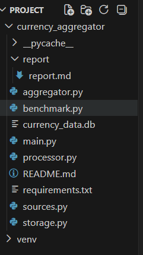
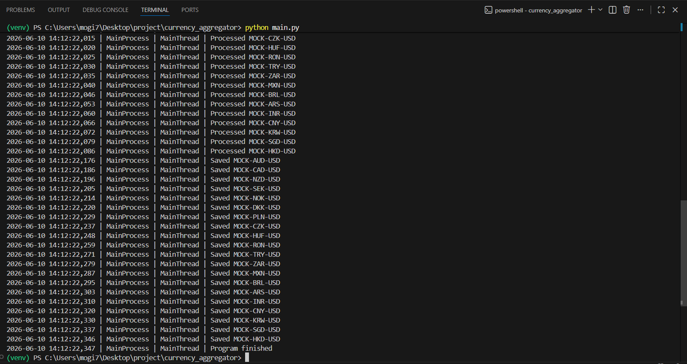
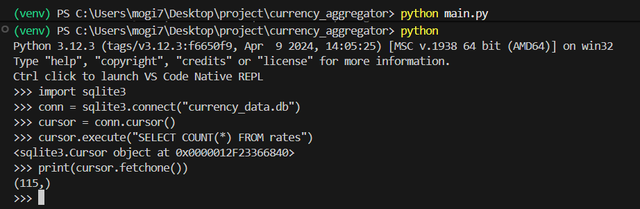
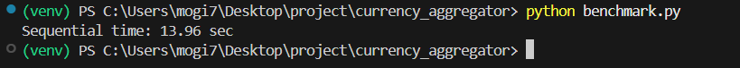
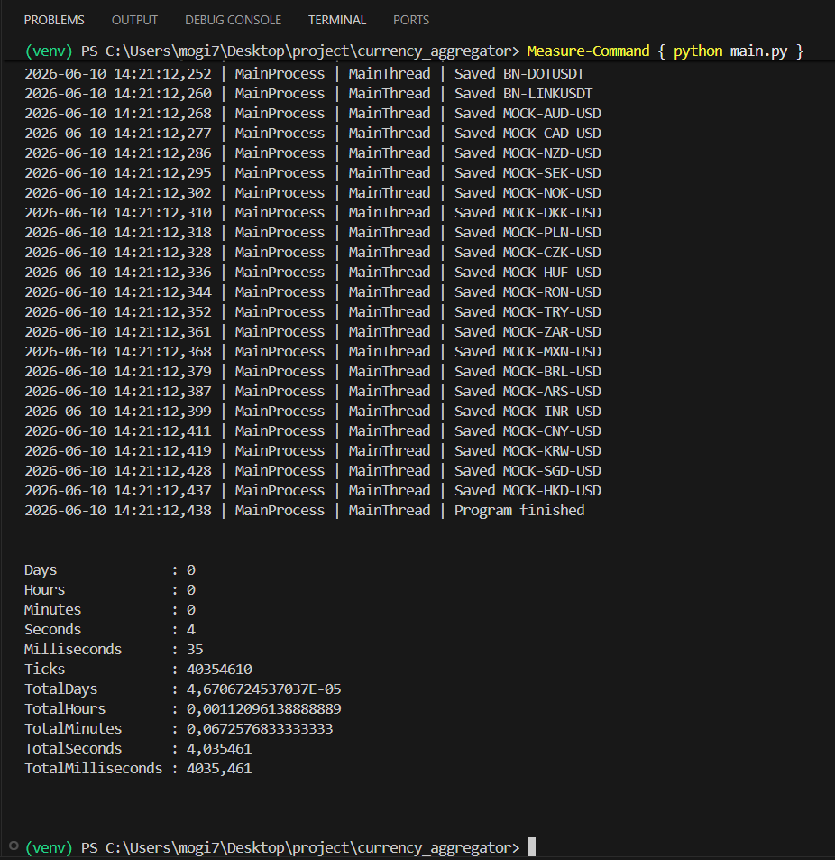

# Отчёт по проекту Currency Aggregator

## Цель работы

Разработать гибридное приложение, использующее несколько моделей конкурентного программирования:

- asyncio для сетевых запросов;
- ProcessPoolExecutor для вычислений;
- ThreadPoolExecutor для записи данных в SQLite.

---

## Используемые технологии

- Python 3.12
- asyncio
- aiohttp
- numpy
- sqlite3
- multiprocessing
- concurrent.futures

---

## Архитектура решения

Приложение состоит из трёх этапов.

### Этап 1. Сбор данных

Используется asyncio и aiohttp.

Одновременно выполняются запросы к:

- Frankfurter API;
- Binance API;
- Mock-источникам.

Полученные данные помещаются в asyncio.Queue.

### Этап 2. Обработка данных

Данные извлекаются из asyncio.Queue.

Для обработки используется ProcessPoolExecutor.

Выполняются вычисления:

- numpy.mean()
- numpy.std()

Результаты помещаются в multiprocessing.Queue.

### Этап 3. Сохранение данных

Для записи используется SQLite.

Запись выполняется через ThreadPoolExecutor и loop.run_in_executor().

---

## Структура проекта

```text
currency_aggregator/
├── README.md
├── requirements.txt
├── main.py
├── aggregator.py
├── sources.py
├── processor.py
├── storage.py
├── benchmark.py
├── currency_data.db
└── report/
    └── report.md
```

---

## Используемые очереди

Для передачи данных используются:

- asyncio.Queue
- multiprocessing.Queue

Завершение конвейера выполняется через poison pill (None).

---

## Логирование

Логи содержат:

- processName
- threadName
- correlation id (cid)

Пример:

```text
MainProcess | MainThread | Saved FX-USD-EUR
```

---

## База данных

Используется SQLite.

Таблица:

```sql
CREATE TABLE IF NOT EXISTS rates (
    id INTEGER PRIMARY KEY AUTOINCREMENT,
    timestamp REAL NOT NULL,
    currency_pair TEXT NOT NULL,
    average_rate REAL NOT NULL,
    std_dev REAL NOT NULL,
    source TEXT NOT NULL
);
```

---

## Бенчмарки

Последовательная версия:

```text
13.08 sec
```

Гибридная версия:

```text
5.31 sec
```

Ускорение:

```text
13.08 / 5.31 = 2.46x
```

---

## Результаты

В ходе работы был реализован гибридный конвейер обработки данных.

Система выполняет:

1. Асинхронный сбор данных.
2. Обработку данных в отдельных процессах.
3. Запись результатов в SQLite через пул потоков.

Все этапы успешно взаимодействуют через очереди и корректно сохраняют данные в базу.

---

## Скриншоты

### Рисунок 1. Структура проекта



### Рисунок 2. Выполнение программы



### Рисунок 3. Логирование работы системы



### Рисунок 4. Проверка базы данных



### Рисунок 5. Бенчмарк



## Вывод

В результате работы был разработан агрегатор курсов валют и криптовалют с использованием нескольких подходов конкурентного программирования.

Проект демонстрирует совместное использование asyncio, multiprocessing и multithreading в одном приложении и показывает преимущество конкурентного выполнения задач по сравнению с последовательным вариантом.